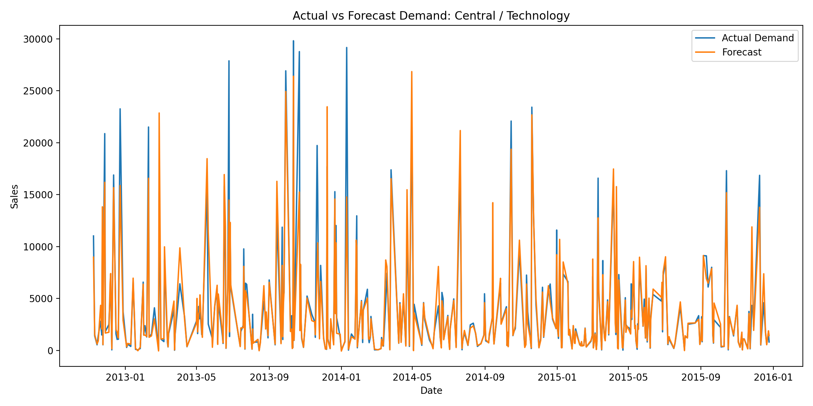
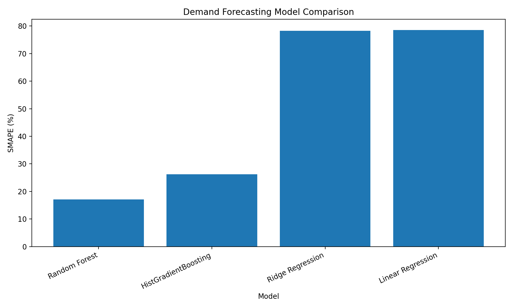
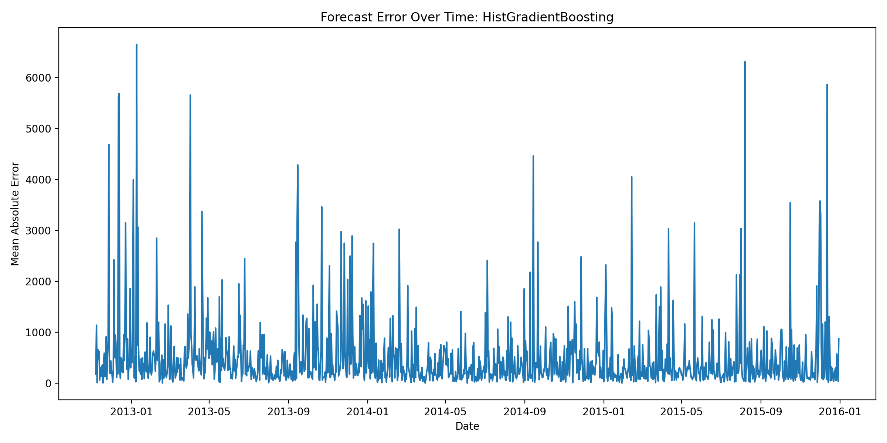

# DemandPilot

**Client-ready retail demand forecasting and business intelligence dashboard.**

  <a href="https://demandpilot-shahriar.streamlit.app/">
    <strong>Live Demo: DemandPilot on Streamlit Cloud</strong>
  </a>

DemandPilot is an end-to-end retail analytics and forecasting product that transforms historical transaction data into demand forecasts, model evaluation reports, and executive-ready business insights. The system includes a reproducible forecasting pipeline, persisted machine-learning model, upload-based inference workflow, Streamlit dashboard, Docker support, and AWS deployment planning.

  

---

## Product Overview

DemandPilot is designed as a practical demand intelligence tool for retail teams. It helps users answer business questions such as:

- Which regions and product categories drive the most demand?
- Which segments are volatile or difficult to forecast?
- Do machine-learning models outperform simple forecasting baselines?
- How do discount, profit, shipping cost, unit price, and margin relate to demand?
- Can a client upload historical retail transactions and generate demand forecasts?

---

## Key Features

- Interactive Streamlit dashboard for retail analytics
- Executive KPI view for sales, profit, orders, and discount trends
- Region and product-category filtering
- Demand explorer for monthly and category-level sales patterns
- Forecasting lab with actual-vs-predicted demand
- Client upload forecasting workflow
- Persisted model inference using `best_demand_model.joblib`
- Baseline forecasting models for comparison
- Machine-learning model comparison with time-aware validation
- Forecast error analysis
- Dockerfile for containerized deployment
- AWS deployment plan for future cloud launch

---

## Dashboard Capabilities

The Streamlit app includes six main sections:

1. **Executive Overview**  
   High-level sales, profit, order, and discount KPIs.

2. **Demand Explorer**  
   Interactive visual analysis by region and product category.

3. **Forecasting Lab**  
   Model comparison, actual-vs-forecast plots, and forecast error visualization.

4. **Client Upload Forecast**  
   Upload a retail transaction CSV and generate region-category demand forecasts using the saved backend model.

5. **Profit & Discount**  
   Analyze the relationship between discounting, profit, category performance, and margin.

6. **Methodology**  
   Documents the pipeline, models, metrics, and cloud-readiness design.

---

## Forecasting Pipeline

    Retail Transaction Data
            ↓
    Data Cleaning
            ↓
    Daily Region-Category Aggregation
            ↓
    Time-Series Feature Engineering
            ↓
    Baseline Forecasting
            ↓
    Machine-Learning Model Training
            ↓
    Time-Aware Model Evaluation
            ↓
    Persisted Best Model
            ↓
    Dashboard + Upload-Based Inference

---

## Modeling Approach

DemandPilot evaluates both simple forecasting baselines and machine-learning models.

### Baselines

- Naive lag-1 forecast
- Seasonal naive lag-7 forecast
- Rolling 7-day mean forecast

### Machine-Learning Models

- Linear Regression
- Ridge Regression
- Random Forest Regressor
- Histogram-based Gradient Boosting Regressor

The best model from the current training run is persisted as:

    models/best_demand_model.joblib

This model is loaded by the backend inference module:

    src/inference.py

---

## Feature Engineering

DemandPilot builds a daily region-category forecasting panel with the following feature groups:

- Region and product category
- Calendar features
- Lagged demand features
- Rolling demand statistics
- Discount signals
- Profit signals
- Order-volume signals
- Shipping-cost features
- Unit-price features
- Product-margin features
- Product-diversity features

The generated feature table is saved as:

    data/processed/forecast_features.csv

---

## Model Evaluation

Models are evaluated using time-aware validation and the following metrics:

- **MAE:** Mean Absolute Error
- **RMSE:** Root Mean Squared Error
- **SMAPE:** Symmetric Mean Absolute Percentage Error
- **WAPE:** Weighted Absolute Percentage Error
- **Bias:** Systematic over- or under-forecasting

Current model comparison:

  

Current best model:

    Random Forest
    SMAPE: approximately 17.1%
    WAPE: approximately 19.7%

---

## Forecast Example

  

---

## Forecast Error Analysis

  

---

## Client Upload Forecasting

The dashboard supports upload-based forecasting. A user can upload a CSV with historical retail transactions, and DemandPilot will:

1. Validate the uploaded schema.
2. Aggregate transactions into daily region-category demand.
3. Build lag and rolling features.
4. Load the saved production model.
5. Generate demand forecasts.
6. Display forecast summaries and downloadable forecast output.

Required upload columns:

    order_date
    region
    product_category
    sales
    profit
    discount
    order_id
    order_quantity
    product_name
    shipping_cost
    unit_price
    product_base_margin

---

## Repository Structure

    DemandPilot/
    ├── app/
    │   └── main.py
    ├── src/
    │   ├── config.py
    │   ├── data_cleaning.py
    │   ├── feature_engineering.py
    │   ├── generate_report_figures.py
    │   ├── inference.py
    │   ├── old_forecasting.py
    │   ├── train_baselines.py
    │   └── train_models.py
    ├── data/
    │   ├── predictions/
    │   ├── processed/
    │   └── raw/
    ├── models/
    │   ├── MODEL_CARD.md
    │   └── best_demand_model.joblib
    ├── reports/
    │   ├── figures/
    │   └── metrics/
    ├── docs/
    │   └── aws_deployment_plan.md
    ├── Dockerfile
    ├── .dockerignore
    ├── requirements.txt
    └── README.md

---

## Tech Stack

- Python
- Pandas
- NumPy
- Scikit-learn
- Streamlit
- Plotly
- Matplotlib
- Joblib
- Docker
- AWS deployment planning

---

## How to Run Locally

Create and activate a virtual environment:

    python -m venv venv
    source venv/bin/activate

Install dependencies:

    pip install -r requirements.txt

Run the full forecasting pipeline:

    python src/feature_engineering.py
    python src/train_baselines.py
    python src/train_models.py
    python src/generate_report_figures.py

Launch the dashboard:

    streamlit run app/main.py

---

## Docker Usage

Build the Docker image:

    docker build -t demandpilot .

Run the container:

    docker run -p 8501:8501 demandpilot

Then open:

    http://localhost:8501

---

## AWS Deployment Plan

DemandPilot includes an AWS deployment plan in:

    docs/aws_deployment_plan.md

The recommended first deployment path is:

    Dockerized Streamlit App
            ↓
    AWS App Runner or Elastic Beanstalk
            ↓
    Future S3 integration for uploaded files and model artifacts
            ↓
    CloudWatch monitoring

---

## Business Value

DemandPilot demonstrates how a retail organization can turn transaction data into a practical forecasting and decision-support system. It combines business intelligence, forecasting, model evaluation, and upload-based inference in a single client-facing product.

---

## Project Status

This project is part of a machine-learning and data-science portfolio focused on applied forecasting, decision-support systems, cloud-ready ML products, and business-facing AI tools.
